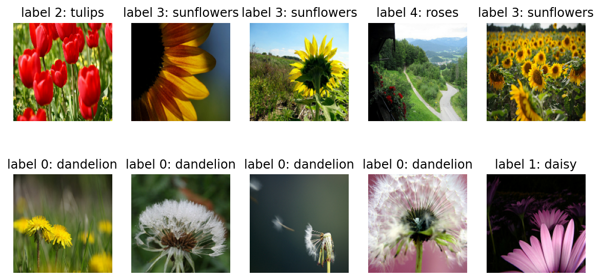
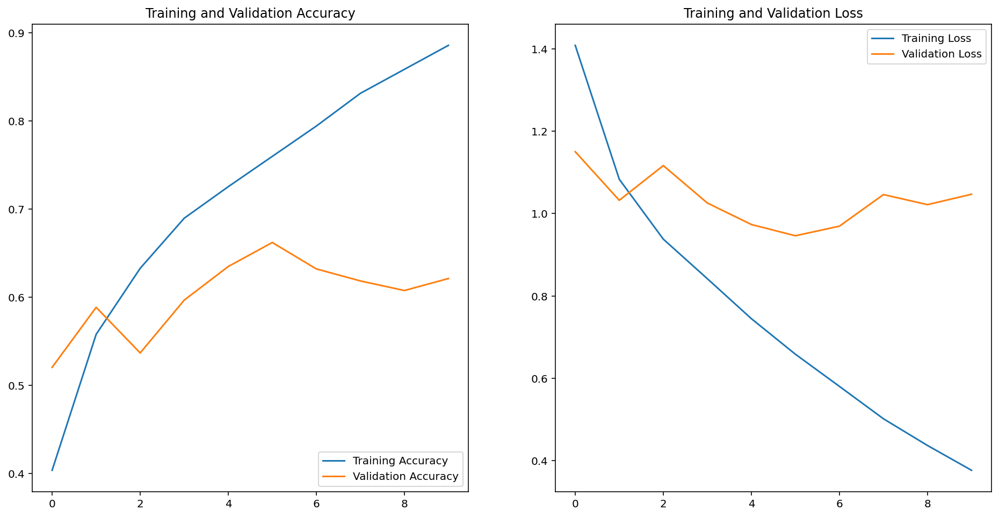
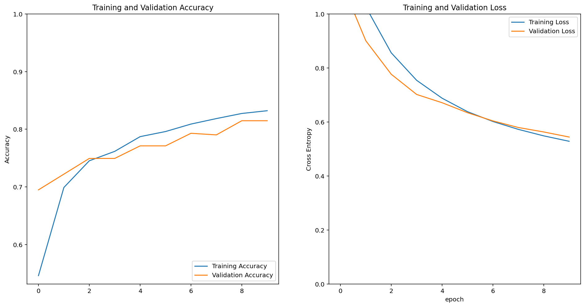
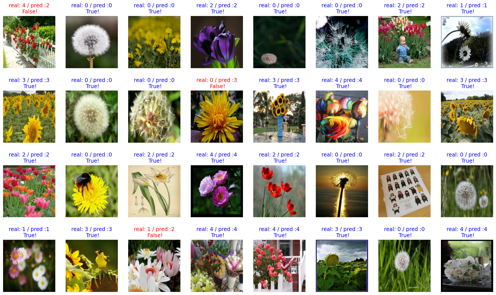
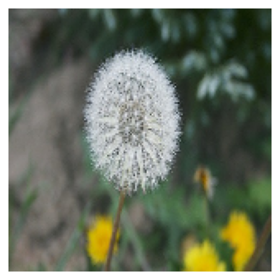
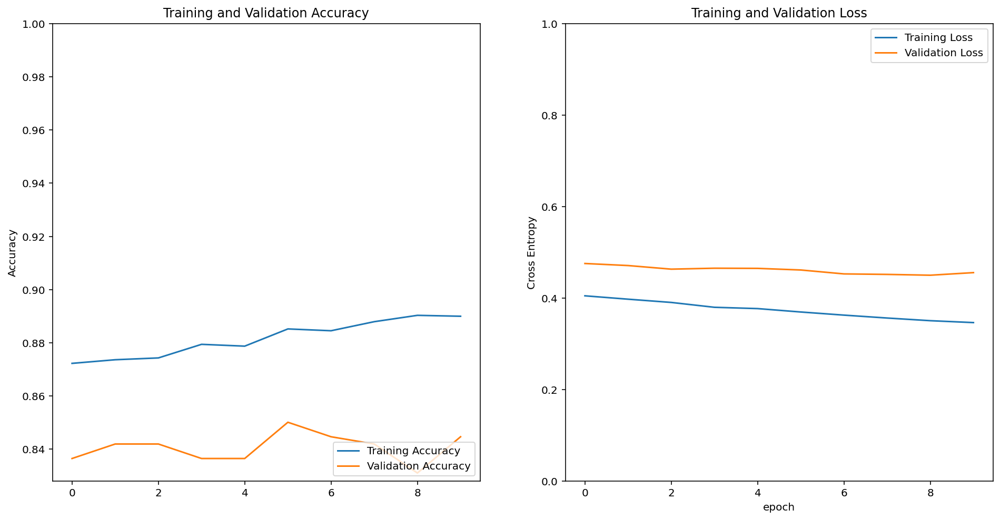

# Step 0. 탠서플로우 및 데이터셋 


```python
import tensorflow as tf
print(tf.__version__)
```

    2.2.0


```python
import tensorflow_datasets as tfds

tfds.__version__
```


    '3.2.1'


# Step 1. tf_flowers 데이터셋 내려받기

- train_data : 80%   
- validation_data : 10%   
- test_data : 10% 


```python
import warnings
warnings.filterwarnings("ignore")
```


```python
(raw_train, raw_validation, raw_test), metadata = tfds.load(
    'tf_flowers',  # instead of 'cats_vs_dogs' 
    split=['train[:80%]', 'train[80%:90%]', 'train[90%:]'],
    with_info=True,
    as_supervised=True,
)
```


```python
print(raw_train)
print(raw_validation)
print(raw_test)
```

    <PrefetchDataset shapes: ((None, None, 3), ()), types: (tf.uint8, tf.int64)>
    <PrefetchDataset shapes: ((None, None, 3), ()), types: (tf.uint8, tf.int64)>
    <PrefetchDataset shapes: ((None, None, 3), ()), types: (tf.uint8, tf.int64)>


```python
import matplotlib.pyplot as plt
%matplotlib inline
%config InlineBackend.figure_format = 'retina'
```

# Step 2. 이미지 통일, 데이터셋 준비


```python
IMG_SIZE = 160 # All images will be resized to 160x160

def format_example(image, label):
    image = tf.cast(image, tf.float32) 
    image = (image/127.5) - 1
    image = tf.image.resize(image, (IMG_SIZE, IMG_SIZE))
    return image, label
```


```python
train = raw_train.map(format_example)
validation = raw_validation.map(format_example)
test = raw_test.map(format_example)   
```


```python
plt.figure(figsize=(10, 5))


get_label_name = metadata.features['label'].int2str

for idx, (image, label) in enumerate(train.take(10)):
    plt.subplot(2, 5, idx+1)
    image = (image + 1) / 2
    plt.imshow(image)
    plt.title(f'label {label}: {get_label_name(label)}')
    plt.axis('off')
```





# Step3 . 모델 설계하기


```python
from tensorflow.keras.models import Sequential
from tensorflow.keras.layers import Dense, Conv2D, Flatten, MaxPooling2D
```


```python
model = Sequential([
    Conv2D(filters=16, kernel_size=3, padding='same', activation='relu', input_shape=(160, 160, 3)),
    MaxPooling2D(),
    Conv2D(filters=32, kernel_size=3, padding='same', activation='relu'),
    MaxPooling2D(),
    Conv2D(filters=64, kernel_size=3, padding='same', activation='relu'),
    MaxPooling2D(),
    Flatten(),
    Dense(units=512, activation='relu'),
    Dense(units=5, activation='softmax')   
    ]) 
    
```

# Step4 . 모델 학습시키기


```python
base_learning_rate = 0.0001
model.compile(optimizer=tf.keras.optimizers.RMSprop(lr=base_learning_rate),
              loss=tf.keras.losses.sparse_categorical_crossentropy,
              metrics=['accuracy'])
```


```python
BATCH_SIZE = 32 
SHUFFLE_BUFFER_SIZE = 1000
```


```python
train_batches = train.shuffle(SHUFFLE_BUFFER_SIZE).batch(BATCH_SIZE)
validation_batches = validation.batch(BATCH_SIZE)
test_batches = test.batch(BATCH_SIZE)
```


```python
validation_steps = 10
loss0, accuracy0 = model.evaluate(validation_batches, steps=validation_steps)

print("initial loss: {:.2f}".format(loss0)) 
print("initial accuracy: {:.2f}".format(accuracy0)) 
```

    10/10 [==============================] - 0s 12ms/step - loss: 1.6171 - accuracy: 0.2031
    initial loss: 1.62
    initial accuracy: 0.20


```python
EPOCHS = 10
history = model.fit(train_batches,
                    epochs=EPOCHS,
                    validation_data=validation_batches)
```

    Epoch 1/10
    92/92 [==============================] - 21s 226ms/step - loss: 1.4083 - accuracy: 0.4036 - val_loss: 1.1502 - val_accuracy: 0.5204
    Epoch 2/10
    92/92 [==============================] - 2s 27ms/step - loss: 1.0833 - accuracy: 0.5579 - val_loss: 1.0322 - val_accuracy: 0.5886
    Epoch 3/10
    92/92 [==============================] - 2s 26ms/step - loss: 0.9379 - accuracy: 0.6328 - val_loss: 1.1164 - val_accuracy: 0.5368
    Epoch 4/10
    92/92 [==============================] - 2s 26ms/step - loss: 0.8419 - accuracy: 0.6897 - val_loss: 1.0256 - val_accuracy: 0.5967
    Epoch 5/10
    92/92 [==============================] - 2s 26ms/step - loss: 0.7448 - accuracy: 0.7255 - val_loss: 0.9734 - val_accuracy: 0.6349
    Epoch 6/10
    92/92 [==============================] - 2s 27ms/step - loss: 0.6585 - accuracy: 0.7599 - val_loss: 0.9461 - val_accuracy: 0.6621
    Epoch 7/10
    92/92 [==============================] - 2s 26ms/step - loss: 0.5804 - accuracy: 0.7943 - val_loss: 0.9694 - val_accuracy: 0.6322
    Epoch 8/10
    92/92 [==============================] - 2s 26ms/step - loss: 0.5018 - accuracy: 0.8314 - val_loss: 1.0461 - val_accuracy: 0.6185
    Epoch 9/10
    92/92 [==============================] - 2s 26ms/step - loss: 0.4370 - accuracy: 0.8587 - val_loss: 1.0216 - val_accuracy: 0.6076
    Epoch 10/10
    92/92 [==============================] - 2s 26ms/step - loss: 0.3768 - accuracy: 0.8859 - val_loss: 1.0469 - val_accuracy: 0.6213


# Step5 . 모델 평가해보기
- 직접 만든 모델은 정확도는 낮고, overfitting 또한 높았다.
- 이러한 단점을 보완하기 위해 아래에서 VGG16 모델을 사용해 볼 것이다.


```python
acc = history.history['accuracy']
val_acc = history.history['val_accuracy']

loss=history.history['loss']
val_loss=history.history['val_loss']

epochs_range = range(EPOCHS)

plt.figure(figsize=(16, 8))
plt.subplot(1, 2, 1)
plt.plot(epochs_range, acc, label='Training Accuracy')
plt.plot(epochs_range, val_acc, label='Validation Accuracy')
plt.legend(loc='lower right')
plt.title('Training and Validation Accuracy')

plt.subplot(1, 2, 2)
plt.plot(epochs_range, loss, label='Training Loss')
plt.plot(epochs_range, val_loss, label='Validation Loss')
plt.legend(loc='upper right')
plt.title('Training and Validation Loss')
plt.show()
```





```python
for image_batch, label_batch in test_batches.take(1):
    images = image_batch
    labels = label_batch
    predictions = model.predict(image_batch)
    pass

predictions
```


    array([[9.03466158e-03, 4.62954352e-03, 7.98982918e-01, 1.10057920e-01,
            7.72949606e-02],
           [8.06304097e-01, 1.75466016e-01, 1.46166626e-02, 7.86286328e-05,
            3.53459269e-03],
           [2.83875197e-01, 4.13067527e-02, 3.54152352e-01, 3.19111913e-01,
            1.55376887e-03],
           [6.84034303e-02, 2.81836361e-01, 5.65303802e-01, 8.58400017e-03,
            7.58724213e-02],
           [6.78720713e-01, 1.02266535e-01, 9.36976299e-02, 2.41920706e-02,
            1.01123057e-01],
           [2.05730826e-01, 4.65319395e-01, 3.11664701e-01, 2.36282661e-03,
            1.49222771e-02],
           [6.26805355e-04, 1.91404462e-01, 8.01480412e-01, 1.51647639e-03,
            4.97193402e-03],
           [4.08716835e-02, 2.67457604e-01, 4.55012023e-01, 1.42113026e-02,
            2.22447410e-01],
           [6.42321585e-03, 1.62508819e-04, 5.72270378e-02, 9.36052203e-01,
            1.34978531e-04],
           [9.87044036e-01, 9.83542856e-03, 1.27141282e-03, 1.92129628e-05,
            1.82977598e-03],
           [9.85480487e-01, 7.96100684e-03, 5.04540652e-03, 7.03485493e-05,
            1.44278770e-03],
           [8.71221870e-02, 1.01015745e-02, 3.09364945e-01, 5.58256567e-01,
            3.51547338e-02],
           [3.31887696e-03, 8.54644105e-02, 3.54623735e-01, 5.37880182e-01,
            1.87128056e-02],
           [5.79927349e-04, 3.44416276e-02, 8.31208944e-01, 5.52198710e-03,
            1.28247499e-01],
           [6.95323586e-01, 8.56308788e-02, 9.51410308e-02, 3.66767566e-03,
            1.20236844e-01],
           [2.48901895e-03, 1.23460137e-03, 8.51742625e-02, 9.10631180e-01,
            4.70862346e-04],
           [1.26602799e-05, 6.48689922e-04, 9.62644339e-01, 1.16897607e-03,
            3.55253071e-02],
           [7.17897415e-01, 4.52463515e-03, 6.97139204e-02, 2.07131222e-01,
            7.32812390e-04],
           [7.29557931e-01, 9.20280442e-02, 1.34230137e-01, 5.90771961e-04,
            4.35930267e-02],
           [6.23560091e-03, 1.85231760e-01, 6.54321671e-01, 4.77263646e-04,
            1.53733715e-01],
           [6.82531099e-05, 2.20532078e-04, 9.09277797e-01, 7.13366866e-02,
            1.90967508e-02],
           [4.96052384e-01, 3.96956533e-01, 6.08010218e-02, 3.62210833e-02,
            9.96890198e-03],
           [1.14099101e-04, 4.08605814e-01, 5.86533725e-01, 3.35352757e-04,
            4.41098819e-03],
           [4.79150027e-01, 3.28285217e-01, 1.29206464e-01, 1.43445302e-02,
            4.90136556e-02],
           [1.64645538e-02, 8.12990010e-01, 1.16507508e-01, 1.03246770e-03,
            5.30054420e-02],
           [1.26010910e-01, 3.86949852e-02, 6.37629628e-01, 1.94075108e-01,
            3.58943129e-03],
           [4.13377816e-03, 7.01360404e-02, 8.10489595e-01, 2.49032346e-05,
            1.15215667e-01],
           [7.54726008e-02, 3.36968243e-01, 3.29064667e-01, 1.33070990e-01,
            1.25423506e-01],
           [1.43808541e-06, 3.22923122e-04, 9.93975937e-01, 1.53285964e-05,
            5.68447681e-03],
           [2.54124273e-02, 7.59564519e-01, 1.07973732e-01, 1.01171307e-01,
            5.87799866e-03],
           [6.01584435e-01, 1.89837798e-01, 1.87475085e-01, 1.12330988e-02,
            9.86958295e-03],
           [5.14665425e-01, 1.17635459e-01, 2.48568743e-01, 1.36578653e-03,
            1.17764555e-01]], dtype=float32)


```python
import numpy as np
predictions = np.argmax(predictions, axis=1)
predictions
```


    array([2, 0, 2, 2, 0, 1, 2, 2, 3, 0, 0, 3, 3, 2, 0, 3, 2, 0, 0, 2, 2, 0,
           2, 0, 1, 2, 2, 1, 2, 1, 0, 0])


```python
count = 0   # 정답을 맞춘 개수
for image, label, prediction in zip(images, labels, predictions):
    # [[YOUR CODE]]
    correct = label == prediction
    if correct:
        count = count + 1

print(count / 32 * 100)    # 약 70% 내외
```

    56.25


# Step4,5 VGG16 Models


```python
IMG_SHAPE = (IMG_SIZE, IMG_SIZE, 3)

# Create the base model from the pre-trained model VGG16
base_model = tf.keras.applications.VGG16(input_shape=IMG_SHAPE,
                                         include_top=False,
                                         weights='imagenet')
```


```python
image_batch.shape
```


    TensorShape([32, 160, 160, 3])


```python
feature_batch = base_model(image_batch)
feature_batch.shape
```


    TensorShape([32, 5, 5, 512])


```python
global_average_layer = tf.keras.layers.GlobalAveragePooling2D()
```


```python
feature_batch_average = global_average_layer(feature_batch)
print(feature_batch_average.shape)
```

    (32, 512)


```python
dense_layer = tf.keras.layers.Dense(512, activation='relu')
prediction_layer = tf.keras.layers.Dense(5, activation='softmax')

# feature_batch_averag가 dense_layer를 거친 결과가 다시 prediction_layer를 거치게 되면
prediction_batch = prediction_layer(dense_layer(feature_batch_average))  
print(prediction_batch.shape)
```

    (32, 5)


```python
base_model.trainable = False
```


```python
model = tf.keras.Sequential([
  base_model,
  global_average_layer,
  dense_layer,
  prediction_layer
])
```


```python
model.summary()
```

    Model: "sequential_1"
    _________________________________________________________________
    Layer (type)                 Output Shape              Param #   
    =================================================================
    vgg16 (Model)                (None, 5, 5, 512)         14714688  
    _________________________________________________________________
    global_average_pooling2d (Gl (None, 512)               0         
    _________________________________________________________________
    dense_2 (Dense)              (None, 512)               262656    
    _________________________________________________________________
    dense_3 (Dense)              (None, 5)                 2565      
    =================================================================
    Total params: 14,979,909
    Trainable params: 265,221
    Non-trainable params: 14,714,688
    _________________________________________________________________


```python
base_learning_rate = 0.0001
model.compile(optimizer=tf.keras.optimizers.RMSprop(lr=base_learning_rate),
              loss=tf.keras.losses.sparse_categorical_crossentropy,
              metrics=['accuracy'])
```


```python
validation_steps=10
loss0, accuracy0 = model.evaluate(validation_batches, steps = validation_steps)

print("initial loss: {:.2f}".format(loss0))
print("initial accuracy: {:.2f}".format(accuracy0))
```

    10/10 [==============================] - 1s 52ms/step - loss: 1.6391 - accuracy: 0.2469
    initial loss: 1.64
    initial accuracy: 0.25


## EPOCHS = 10 일 때 약 test accuracy = 0.83%가 나왔다


```python
EPOCHS = 10   

history = model.fit(train_batches,
                    epochs=EPOCHS,
                    validation_data=validation_batches)
```

    Epoch 1/10
    92/92 [==============================] - 54s 586ms/step - loss: 1.3413 - accuracy: 0.5460 - val_loss: 1.1258 - val_accuracy: 0.6948
    Epoch 2/10
    92/92 [==============================] - 7s 74ms/step - loss: 1.0260 - accuracy: 0.6989 - val_loss: 0.9005 - val_accuracy: 0.7221
    Epoch 3/10
    92/92 [==============================] - 7s 74ms/step - loss: 0.8559 - accuracy: 0.7452 - val_loss: 0.7766 - val_accuracy: 0.7493
    Epoch 4/10
    92/92 [==============================] - 7s 75ms/step - loss: 0.7541 - accuracy: 0.7616 - val_loss: 0.7017 - val_accuracy: 0.7493
    Epoch 5/10
    92/92 [==============================] - 7s 75ms/step - loss: 0.6879 - accuracy: 0.7871 - val_loss: 0.6711 - val_accuracy: 0.7711
    Epoch 6/10
    92/92 [==============================] - 7s 75ms/step - loss: 0.6380 - accuracy: 0.7960 - val_loss: 0.6341 - val_accuracy: 0.7711
    Epoch 7/10
    92/92 [==============================] - 7s 75ms/step - loss: 0.6016 - accuracy: 0.8089 - val_loss: 0.6037 - val_accuracy: 0.7929
    Epoch 8/10
    92/92 [==============================] - 7s 75ms/step - loss: 0.5724 - accuracy: 0.8185 - val_loss: 0.5793 - val_accuracy: 0.7902
    Epoch 9/10
    92/92 [==============================] - 7s 75ms/step - loss: 0.5483 - accuracy: 0.8273 - val_loss: 0.5628 - val_accuracy: 0.8147
    Epoch 10/10
    92/92 [==============================] - 7s 75ms/step - loss: 0.5283 - accuracy: 0.8321 - val_loss: 0.5440 - val_accuracy: 0.8147


## 목표치인 85%를 위해 epochs 를 늘려보겠다
- test accuracy = 약 86%
- val_ accuracy = 약 84% 의 결과값을 얻었다!


```python
EPOCHS = 10   

history = model.fit(train_batches,
                    epochs=EPOCHS,
                    validation_data=validation_batches)
```

    Epoch 1/10
    92/92 [==============================] - 7s 74ms/step - loss: 0.5099 - accuracy: 0.8328 - val_loss: 0.5327 - val_accuracy: 0.8174
    Epoch 2/10
    92/92 [==============================] - 7s 74ms/step - loss: 0.4950 - accuracy: 0.8386 - val_loss: 0.5235 - val_accuracy: 0.8256
    Epoch 3/10
    92/92 [==============================] - 7s 74ms/step - loss: 0.4801 - accuracy: 0.8450 - val_loss: 0.5278 - val_accuracy: 0.8120
    Epoch 4/10
    92/92 [==============================] - 7s 74ms/step - loss: 0.4708 - accuracy: 0.8454 - val_loss: 0.5211 - val_accuracy: 0.8120
    Epoch 5/10
    92/92 [==============================] - 7s 74ms/step - loss: 0.4585 - accuracy: 0.8505 - val_loss: 0.5216 - val_accuracy: 0.8147
    Epoch 6/10
    92/92 [==============================] - 7s 74ms/step - loss: 0.4476 - accuracy: 0.8573 - val_loss: 0.4957 - val_accuracy: 0.8283
    Epoch 7/10
    92/92 [==============================] - 7s 74ms/step - loss: 0.4383 - accuracy: 0.8566 - val_loss: 0.4932 - val_accuracy: 0.8283
    Epoch 8/10
    92/92 [==============================] - 7s 75ms/step - loss: 0.4283 - accuracy: 0.8607 - val_loss: 0.4825 - val_accuracy: 0.8283
    Epoch 9/10
    92/92 [==============================] - 7s 74ms/step - loss: 0.4211 - accuracy: 0.8658 - val_loss: 0.4855 - val_accuracy: 0.8338
    Epoch 10/10
    92/92 [==============================] - 7s 75ms/step - loss: 0.4134 - accuracy: 0.8665 - val_loss: 0.4816 - val_accuracy: 0.8392


```python
acc = history.history['accuracy']
val_acc = history.history['val_accuracy']

loss = history.history['loss']
val_loss = history.history['val_loss']

plt.figure(figsize=(16, 8))
plt.subplot(1, 2, 1)
plt.plot(acc, label='Training Accuracy')
plt.plot(val_acc, label='Validation Accuracy')
plt.legend(loc='lower right')
plt.ylabel('Accuracy')
plt.ylim([min(plt.ylim()),1])
plt.title('Training and Validation Accuracy')

plt.subplot(1, 2, 2)
plt.plot(loss, label='Training Loss')
plt.plot(val_loss, label='Validation Loss')
plt.legend(loc='upper right')
plt.ylabel('Cross Entropy')
plt.ylim([0,1.0])
plt.title('Training and Validation Loss')
plt.xlabel('epoch')
plt.show()
```





```python
for image_batch, label_batch in test_batches.take(1):
    images = image_batch
    labels = label_batch
    predictions = model.predict(image_batch)
    pass

predictions
```


    array([[2.80806459e-02, 7.65565112e-02, 7.13309228e-01, 6.49905428e-02,
            1.17063105e-01],
           [9.98751044e-01, 9.32901050e-04, 2.16579811e-05, 1.16763025e-04,
            1.77527763e-04],
           [7.15714157e-01, 1.16485864e-01, 2.83592455e-02, 1.11246206e-01,
            2.81944908e-02],
           [4.26231744e-03, 1.78851262e-02, 5.74576139e-01, 1.40151270e-02,
            3.89261246e-01],
           [6.74733937e-01, 2.57424980e-01, 2.04741396e-02, 1.94345415e-02,
            2.79323962e-02],
           [9.17418420e-01, 4.65626493e-02, 7.51557294e-03, 2.58713532e-02,
            2.63212365e-03],
           [1.90465469e-02, 1.98961329e-02, 6.94025576e-01, 1.75571188e-01,
            9.14605707e-02],
           [3.70389223e-01, 4.47881967e-01, 3.59367416e-03, 1.70669377e-01,
            7.46576348e-03],
           [1.12364758e-02, 3.23611870e-03, 3.53854783e-02, 8.77842247e-01,
            7.22996518e-02],
           [9.99272406e-01, 6.35807344e-04, 3.00580791e-06, 8.07091928e-05,
            8.04520187e-06],
           [9.67941523e-01, 2.45929621e-02, 1.13268232e-03, 3.86249973e-03,
            2.47044279e-03],
           [1.84293985e-01, 2.04822972e-01, 1.94874898e-01, 4.07869726e-01,
            8.13838467e-03],
           [1.30557707e-02, 1.87097304e-02, 1.62219584e-01, 6.00139201e-01,
            2.05875665e-01],
           [2.57938099e-03, 2.58810241e-02, 3.84873420e-01, 7.35709444e-02,
            5.13095200e-01],
           [8.71319652e-01, 6.36815056e-02, 1.48395784e-02, 1.15843536e-02,
            3.85749452e-02],
           [2.18885485e-03, 2.93236808e-03, 2.31441278e-02, 9.48470533e-01,
            2.32641194e-02],
           [3.65510513e-03, 1.04985209e-02, 8.01234663e-01, 5.61502464e-02,
            1.28461421e-01],
           [8.60267341e-01, 1.14246242e-01, 1.92956987e-03, 2.20761746e-02,
            1.48064888e-03],
           [6.75385119e-03, 1.57003403e-01, 4.55972403e-01, 1.86189204e-01,
            1.94081232e-01],
           [7.79250041e-02, 5.47424890e-02, 3.37719232e-01, 3.61314565e-02,
            4.93481845e-01],
           [1.46407485e-01, 2.67369002e-01, 3.94332558e-01, 9.99950245e-02,
            9.18959454e-02],
           [9.60962951e-01, 2.02043131e-02, 3.48600047e-03, 1.20796300e-02,
            3.26710381e-03],
           [1.33212944e-02, 3.74485046e-01, 4.16007340e-01, 2.43079234e-02,
            1.71878427e-01],
           [9.83474314e-01, 8.08484014e-03, 2.16038362e-03, 5.55744581e-03,
            7.23034900e-04],
           [1.67920634e-01, 7.14047670e-01, 3.14119570e-02, 3.17286402e-02,
            5.48910499e-02],
           [2.03716755e-02, 4.81013805e-02, 2.09231809e-01, 4.92362648e-01,
            2.29932487e-01],
           [1.35209654e-02, 2.56559044e-01, 6.74855649e-01, 4.28781882e-02,
            1.21860625e-02],
           [1.91225461e-03, 3.41190770e-03, 1.21671051e-01, 5.09670861e-02,
            8.22037697e-01],
           [5.74337645e-03, 1.75033528e-02, 2.72292197e-01, 1.17054231e-01,
            5.87406874e-01],
           [1.31241471e-01, 8.19305629e-02, 1.32367462e-01, 5.43002009e-01,
            1.11458451e-01],
           [9.92680311e-01, 2.36096652e-03, 1.55946298e-03, 3.12890788e-03,
            2.70455203e-04],
           [1.16888806e-02, 1.34336902e-02, 3.58840078e-02, 7.49720335e-02,
            8.64021361e-01]], dtype=float32)


```python
import numpy as np
predictions = np.argmax(predictions, axis=1)
predictions
```


    array([2, 0, 0, 2, 0, 0, 2, 1, 3, 0, 0, 3, 3, 4, 0, 3, 2, 0, 2, 4, 2, 0,
           2, 0, 1, 3, 2, 4, 4, 3, 0, 4])


```python
plt.figure(figsize=(20, 12))

for idx, (image, label, prediction) in enumerate(zip(images, labels, predictions)):
    plt.subplot(4, 8, idx+1)
    image = (image + 1) / 2
    plt.imshow(image)
    correct = label == prediction
    title = f'real: {label} / pred :{prediction}\n {correct}!'
    if not correct:
        plt.title(title, fontdict={'color': 'red'})
    else:
        plt.title(title, fontdict={'color': 'blue'})
    plt.axis('off')
```





```python
count = 0
for image, label, prediction in zip(images, labels, predictions):
    correct = label == prediction
    if correct:
        count = count + 1

print(count / 32 * 100) # 약 95% 내외
```

    90.625


```python
import os

checkpoint_dir = os.getenv("HOME") + "/aiffel/tf_flowers/checkpoint"
checkpoint_file_path = os.path.join(checkpoint_dir, 'checkpoint')

if not os.path.exists('checkpoint_dir'):
    os.mkdir('checkpoint_dir')
    
model.save_weights(checkpoint_file_path)     # checkpoint 파일 생성

if os.path.exists(checkpoint_file_path):
  print('checkpoint 파일 생성 OK!!')
```

    checkpoint 파일 생성 OK!!


```python
img_dir_path = os.getenv("HOME") + "/aiffel/tf_flowers/images"
os.path.exists(img_dir_path)
```


    True


```python
from tensorflow.keras.preprocessing.image import load_img, img_to_array
```

# 이미지 파일 분류 함수 선언


```python
def show_and_predict_image(dirpath, filename, img_size=160):
    filepath = os.path.join(dirpath, filename)
    image = load_img(filepath, target_size=(img_size, img_size))
    plt.imshow(image)
    plt.axis('off')
    image = img_to_array(image).reshape(1, img_size, img_size, 3)
    prediction = model.predict(image)[0]
    flower0_percentage = round(prediction[0] * 100)
    flower1_percentage = round(prediction[1] * 100)
    flower2_percentage = round(prediction[2] * 100)
    flower3_percentage = round(prediction[3] * 100)
    flower4_percentage = round(prediction[4] * 100)
    print(f"This image seems {flower0_percentage}% dandelion,and {flower1_percentage}% daisy, and {flower2_percentage}% tulips,and {flower3_percentage}% sunflower. and {flower4_percentage}% roses.")
```

# 번외 : 구글링을 통해 임의의 사진들을 위의 분류 함수로 분류해보았다

- 구글의 이미지들이 선명하고 명확해서인지 모두 정답률 100%로 분류해 내었다!   
- 분류모델이 아닌 이미지를 넣었을 때  코스모스는 sunflower로, 벚꽃은 rose로 분류했다  


```python
filename = 'flower3.jpg'

show_and_predict_image(img_dir_path, filename)
```

    This image seems 0.0% dandelion,and 0.0% daisy, and 0.0% tulips,and 100.0% sunflower. and 0.0% roses.


```python
filename = 'flower4.jpeg'

show_and_predict_image(img_dir_path, filename)
```

    This image seems 0.0% dandelion,and 0.0% daisy, and 0.0% tulips,and 0.0% sunflower. and 100.0% roses.


```python
filename = '튤립.jpg'

show_and_predict_image(img_dir_path, filename)
```

    This image seems 0.0% dandelion,and 0.0% daisy, and 100.0% tulips,and 0.0% sunflower. and 0.0% roses.


```python
filename = '민들레.jpeg'

show_and_predict_image(img_dir_path, filename)
```

    This image seems 100.0% dandelion,and 0.0% daisy, and 0.0% tulips,and 0.0% sunflower. and 0.0% roses.





```python
filename = '데이지.jpg'

show_and_predict_image(img_dir_path, filename)
```

    This image seems 0.0% dandelion,and 100.0% daisy, and 0.0% tulips,and 0.0% sunflower. and 0.0% roses.


```python
filename = '코스모스.jpeg'

show_and_predict_image(img_dir_path, filename)
```

    This image seems 0.0% dandelion,and 0.0% daisy, and 0.0% tulips,and 100.0% sunflower. and 0.0% roses.


```python
filename = '벚꽃.jpg'

show_and_predict_image(img_dir_path, filename)
```

    This image seems 0.0% dandelion,and 0.0% daisy, and 0.0% tulips,and 0.0% sunflower. and 100.0% roses.


# 번외2 : 학습 방식 바꿔보기 : Adam   
- 위에서 RMSProp 방식으로 학습시켰다.   
- 이번에는 개선된 방식인 Adam 방식으로 결과가 어떨지 확인해 보겠다.


```python
base_learning_rate = 0.0001
model.compile(optimizer=tf.keras.optimizers.Adam(lr=base_learning_rate),
              loss=tf.keras.losses.sparse_categorical_crossentropy,
              metrics=['accuracy'])
```

## RMSProp 방식에 비해 정확도가 89%로 높았다. 


```python
EPOCHS = 10   

history = model.fit(train_batches,
                    epochs=EPOCHS,
                    validation_data=validation_batches)
```

    Epoch 1/10
    92/92 [==============================] - 7s 75ms/step - loss: 0.4047 - accuracy: 0.8723 - val_loss: 0.4754 - val_accuracy: 0.8365
    Epoch 2/10
    92/92 [==============================] - 7s 75ms/step - loss: 0.3973 - accuracy: 0.8736 - val_loss: 0.4709 - val_accuracy: 0.8420
    Epoch 3/10
    92/92 [==============================] - 7s 73ms/step - loss: 0.3902 - accuracy: 0.8743 - val_loss: 0.4630 - val_accuracy: 0.8420
    Epoch 4/10
    92/92 [==============================] - 7s 73ms/step - loss: 0.3796 - accuracy: 0.8794 - val_loss: 0.4650 - val_accuracy: 0.8365
    Epoch 5/10
    92/92 [==============================] - 7s 74ms/step - loss: 0.3767 - accuracy: 0.8787 - val_loss: 0.4647 - val_accuracy: 0.8365
    Epoch 6/10
    92/92 [==============================] - 7s 74ms/step - loss: 0.3693 - accuracy: 0.8852 - val_loss: 0.4612 - val_accuracy: 0.8501
    Epoch 7/10
    92/92 [==============================] - 7s 80ms/step - loss: 0.3625 - accuracy: 0.8845 - val_loss: 0.4526 - val_accuracy: 0.8447
    Epoch 8/10
    92/92 [==============================] - 7s 79ms/step - loss: 0.3561 - accuracy: 0.8879 - val_loss: 0.4515 - val_accuracy: 0.8420
    Epoch 9/10
    92/92 [==============================] - 7s 75ms/step - loss: 0.3503 - accuracy: 0.8903 - val_loss: 0.4497 - val_accuracy: 0.8311
    Epoch 10/10
    92/92 [==============================] - 7s 79ms/step - loss: 0.3461 - accuracy: 0.8900 - val_loss: 0.4554 - val_accuracy: 0.8447


```python
acc = history.history['accuracy']
val_acc = history.history['val_accuracy']

loss = history.history['loss']
val_loss = history.history['val_loss']

plt.figure(figsize=(16, 8))
plt.subplot(1, 2, 1)
plt.plot(acc, label='Training Accuracy')
plt.plot(val_acc, label='Validation Accuracy')
plt.legend(loc='lower right')
plt.ylabel('Accuracy')
plt.ylim([min(plt.ylim()),1])
plt.title('Training and Validation Accuracy')

plt.subplot(1, 2, 2)
plt.plot(loss, label='Training Loss')
plt.plot(val_loss, label='Validation Loss')
plt.legend(loc='upper right')
plt.ylabel('Cross Entropy')
plt.ylim([0,1.0])
plt.title('Training and Validation Loss')
plt.xlabel('epoch')
plt.show()
```





```python
count = 0   # 정답을 맞춘 개수
for image, label, prediction in zip(images, labels, predictions):
    # [[YOUR CODE]]
    correct = label == prediction
    if correct:
        count = count + 1

print(count / 32 * 100)    # 약 70% 내외
```

    90.625


# 결론    
- 학습 모델에 따라 정확도가 달라진다.
- RMSProp 에 비해 Adam 의 학습모델 성능이 좋았다.
- epochs 를 늘리면 정확도가 향상된다.   
- 분류 함수로 클래스에 맞는 이미지들을 잘 분류 했다.   
- 클래스에 없는 꽃 들은 비슷한 모양으로 분류하는 것 같다.


```python

```
